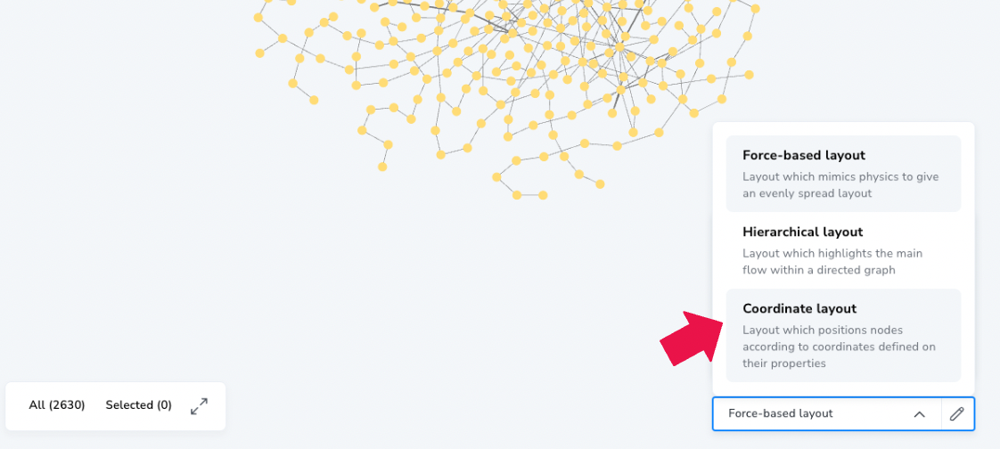
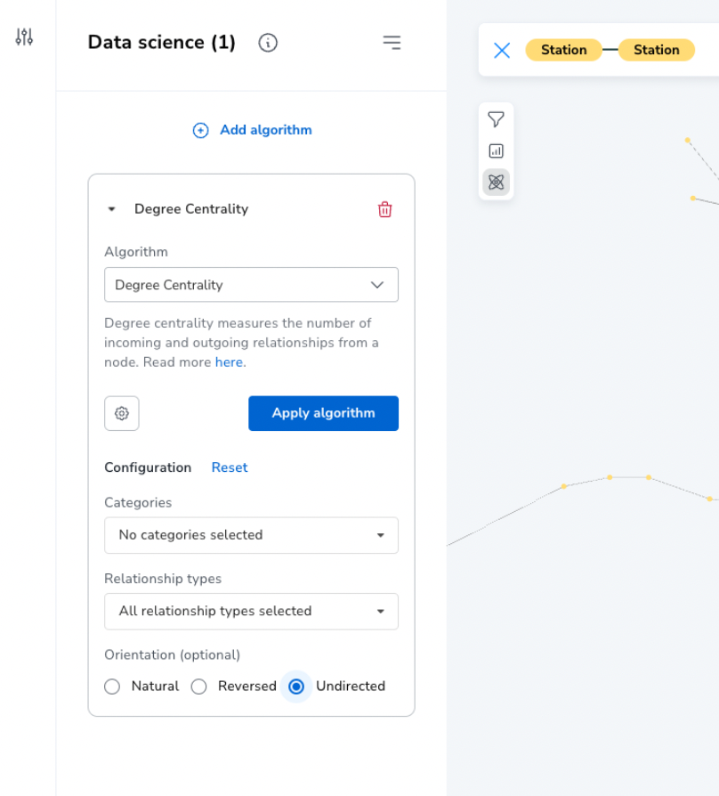

# Analyzing the London Underground Network 
__Neo4j Graph Data Science & Explore__

## Summary
In this example, we show how [Neo4j Graph Data Science](https://neo4j.com/docs/graph-data-science/current/algorithms/) can be used to analysis transportation, logistics, and supply chain networks. Specifically, we show how to use graphs data science to
- obtain a more complete picture of your operations
- better understand resource needs and interdependencies between components, 
- and measure risks that would otherwise be difficult to uncover in conventional analytics tools

We will demonstrate this using a dataset of the London underground, a rapid transit system serving greater London and some parts of the adjacent home counties of Buckinghamshire, Essex and Hertfordshire in England. We will walk through how to identify stations that require more resources to run effectively, which stations can pose the greatest risk of bottlenecks and propagating delays, and how different stations depend on each other.

## Outline
1. Graph Data Science Algorithms for Transportation, Logistics, and Supply Chain
2. Setup
3. Visualize the Network in Explore
4. Analyze Operational Load, Flow Control, and Transitive Influence
5. Visualize Regional Interdependencies between stations

## Graph Data Science Algorithms for Transportation, Logistics, and Supply Chain
Graph Data Science has a [large family of algorithms](https://neo4j.com/docs/graph-data-science/current/algorithms/) for analytics and ML.  In this example we will cover a few useful ones for transportation, logistics, and supply chain networks: [Degree](https://neo4j.com/docs/graph-data-science/current/algorithms/degree-centrality/), [Betweenness](https://neo4j.com/docs/graph-data-science/current/algorithms/betweenness-centrality/), and [Eigenvector centrality](https://neo4j.com/docs/graph-data-science/current/algorithms/eigenvector-centrality/) as well as [Louvain Community Detection](https://neo4j.com/docs/graph-data-science/current/algorithms/louvain/). Below is a summary for how to interpret the results of each algorithm, in this context:

- __Degree Centrality measures *operational load*__ for stages in your network. According to the study [The association between network centrality measures and supply chain performance](https://doi.org/10.1016/j.procs.2021.01.153), stages with high operational load have to manage larger inflows and outflows and may be forced to reconcile schedules and priorities more often. All else held constant, __stages with higher operational load tend to require more resources to run effectively__.

- __Betweenness Centrality measures *flow control*__ for stages in your network. Stages with high Betweenness Centrality have more control over the flow of passengers, materials, and/or cargo because they connect many other stages together that may otherwise be disconnected or connected through much longer less efficient paths. All else held constant, __stages with higher flow control present higher risk for causing bottlenecks if they encounter delays or other issues__.

- __Eigenvector Centrality measures *transitive influence*__ for stages in your network. Stages with high Eigenvector Centrality are depended upon by other critical stages. All else held constant, __stages with higher transitive influence present higher risk of carrying over or propagating their delays and/or performance issues to other stages in the network__.

- __Louvain Community Detection finds *regional interdependence*__ between stages in your network by identifying groups that have highly interconnected flows. All else held constant, __stages within the same group will have stronger interdependence on each other relative to stages outside the group__.

## Setup
To begin the example you need to load the data into a Neo4j Database.  We also recommend using our perspective to match the visualization styling.

### Loading the Dataset
We have the dataset available in the form of a Neo4j dump file [here](https://github.com/neo4j-product-examples/ds-supply-chain-use-cases/blob/main/transportation-network-london-underground/neo4j.dump).  If you are using AuraDS you can load this via the [database import process](https://neo4j.com/docs/aura/auradb/importing/import-database/). If you are using a self-managed Neo4j installation you can load this via [neo4 admin database load](https://neo4j.com/docs/operations-manual/current/backup-restore/restore-dump/). 

### Using Explore/Bloom & Loading the Perspective
While Neo4j Graph Data Science can be leveraged programmatically for Data Science & Machine Learning pipelines, we will use [Explore (also known as Bloom)](https://neo4j.com/docs/bloom-user-guide/current/) to show how you can explore and analyze the graph through a visual interface.

To help a bit with styling, we have a prepared [this perspective](https://github.com/neo4j-product-examples/ds-supply-chain-use-cases/blob/main/transportation-network-london-underground/bloom-perspective.json) which will help align the style of the Explore visualizations. See [these directions](https://neo4j.com/docs/bloom-user-guide/current/bloom-perspectives/perspective-creation/#_creating_a_perspective) for importing and using the Bloom Perspective.  

## Visualize the London Underground Network
1. Use the search bar to get Station to Station relationships. This should pull the entire London Underground network into the scene.

2. Apply the coordinate layout.  Use the 'point' property for both the x and y axes.  If needed you can adjust the scale on both the x and y axes with the sliders to best fit your display.

## Analyze Operational Load, Flow Control, and Transitive Influence

### 1. Operational Load
1. Click on the Graph Data Science Integration button.  A side panel should open and you should see an "Add algorithm" option.
2. Click on "Add algorithm" and select __Degree Centrality__.
3. Click the gear Icon for settings.  In the Categories drop down, select Station. Under Orientation, select the Undirected option. This will configure degree centrality to reflect operational load.

4. Click "Apply algorithm" to run.  
5. When complete, turn on Rule-based Styling. This will highlight with size and color which stations have the highest degree centrality / operational load.

6. Next, click on the slicer

7. Select Add range and select "Degree Centrality". This should show the degree centrality distribution in the dataset. 
8. You can move the slicer to focus on stations with higher/lower operational load. The "Paddington" station should have the highest score at 20, but there are many others with high scores too. These stations have the highest operational load.

9. Feel free to explore further!

### 2. Flow Control
1. Turn off Rule-based styling for degree centrality.
2. Click on "Add algorithm" and select __Betweenness Centrality__.
3. Click the gear icon for settings.  Select station in the Categories drop down. Leave everything else as default. Betweenness Centrality will reflect flow control
4. Click "Apply algorithm" to run.

5. You can repeat steps 5-9 from Operational Load for this metric. The station with the highest Betweenness Centrality / flow control should be "Liverpool Street" at 78,819.98, and other stations like Bank, London Bridge, and Stratford also have high scores. 

### 3. Transitive Influence (Optional)
1. Turn off Rule-based styling for betweenness centrality.
2. Click on "Add algorithm" and select __Eigenvector Centrality__.
3. Click the gear icon for settings.  Select station in the Categories drop down, and select Reverse under orientation. Eigenvector Centrality will now reflect transitive influence
4. Click "Apply algorithm" to run.

5. You can repeat steps 5-9 from Operational Load for this metric. The station with the highest Eigenvector Centrality / transitive influence should be "Paddington" at 0.51.  It is also worth noting that stations between Heathrow and Paddington are all high suggesting that that particular path is critical for the network. 

### Visualize Regional Interdependencies Between Stations

1. Turn off Rule-based styling for egienvector centrality.
2. Click on "Add algorithm" and select __Louvain__.
3. Click the gear icon for settings.  Select station in the Categories drop down. Leave everything else as default. Louvain will identify regions of stations that are highly interdependent on each other
4. Click "Apply algorithm" to run.
5. When complete, turn on Rule-based Styling. This will use colors to identify the different regions/communities of stations. 

6. Feel free to explore from here to understand how the different stations group together and depend on each other 

